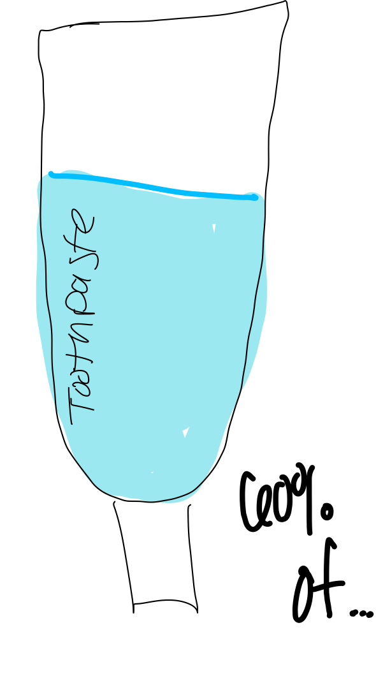
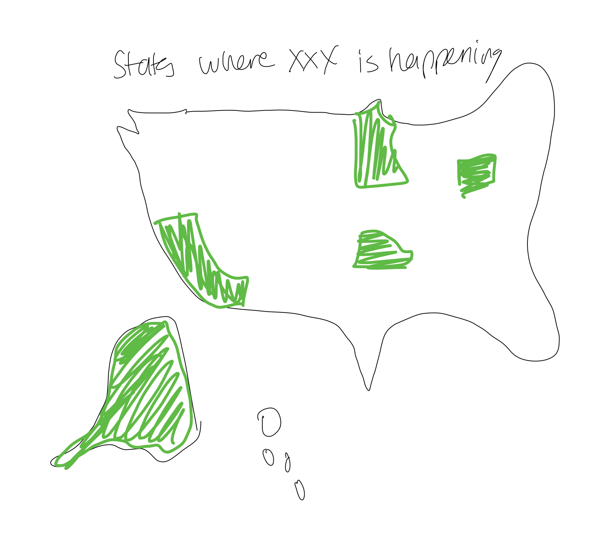

| [home page](https://kjmattso.github.io/Mattson-portfolio/) | [visualizing-government-debt](https://kjmattso.github.io/Mattson-portfolio/Visualizing_gov_debt.html) | [critique by design](https://kjmattso.github.io/Mattson-portfolio/Critique_by_design.html) | [final project I](https://kjmattso.github.io/Mattson-portfolio/final_project_pt1.html) | [final project II](final-project-part-two) | [final project III](final-project-part-three) |

# Final Project Part 1

This is the first part of the development of my final project for Telling Stories with Data Spring 2024.

## Project Background

I am choosing to make an informative presentation about Children's Dental Health. I know, it seems an off topic, but it's one I care a lot about. Having worked at a free dental clinic, I have seen numerous children suffer from what it, almost an entirely preventable, disease. Also unbeknownst to most is that dental cavities are the most prevalant childhood condition, more so than asthma or diabetes even. I won't go in to specifics here, I am saving that for the final, but there are serious health complications if people don't pay attention. 

More importantly to me, is that not enough people care, yet. I consider this a growing public health emergency, that we can easily stop. Especially since the COVID-19 pandemic. 

## Project Outline

### TLDR: Cavities are the most common childhood condition, with life-long effects, but no one is doing enough about it.

The final project will take a simple approach, of starting broad, and narrowing down as we move through the presentation. I will start with some basic facts, hooking the audience in with the severity of the topic, and showing them they SHOULD care. Much of this will be scientific research and raw data of children's health outcomes. At this point I would also like to incorporate national and international comparisons, showing how disparities in children's outcomes. This part will also have a brief history of what I consider important events in public oral health history. This will have the joint effect of letting audience members get some history, while also showing them that this issue has been persistent and ongoing.

The headings of these sections will likely be something along these lines:

### History
### Outcomes
### Where are we today?

After the introduction. I plan to present some research on how standard care can improve outcomes. This won't be a formal call to action yet, but will support a later one. Resources on proper hygiene and care will be available form outside sources, and I would like to use a series of graphs to visualizations to show the before and after impacts of basic care. This will begin to inform the audience about how easily this could be prevented if we raised public awareness. This heading will draw attention to the options that the average person has to treat this:

### Treatments
or 
### What can you do?

Following this, I plan to elaborate on some policy interventions at play and introduce care remedies that might not be doable at home, but are not impossible resources to utilize. Again, this continues to drive home the point of "we should care, we can make a difference". More visualizations showing before and after outcomes will be included, and maybe heatmaps that show the utilization of national policy measures would be helpful and provide a regional connection to American audiences. ("I'm so happy my state does this" or "Why doesn't my state do this?") Again, we aren't quite at teh formal call to action, but we need this info. for it. These section names will call attention to the work of policy:

### Government Interventions
### Policy Interventions
or
### What's already being done

Here comes the call to action: real policies or at-home actions that people can take . I will hyperlink info. more steps people can take after the presentation, and also another big opportunity: raising awareness.I will rely heavily on good graphics to draw attention, as I know many people don't care as much as they should about this topic, and I want them to remember it. 

## Sample Visualizations and Project Stages

For my visualizations I plan to lean into the theme, utilizing dental care related imaging. Think smiles and toothbrushes! I will also have a consistent color theme, I am thinkign green, grey, white, etc. Those colors give me a really bright, minty fresh vibe
! Below I have embeded some quickly drawn sample images.

### Timeline
This will be used to show a historical time line. I would love to make it interactive and allow people to hover over it to see more detail. 

### Count Icons
I will likely use a style like this to share stats about the prevalance of conditions, or the lack of access to care, etc. It is a simple, well known way to share data, and I am hoping to keep the messaging simple and eye catching!

### Bulleted Lists
To stay on theme and have a little fun, I plan to use smileys whenever possible to list facts. It likely won't be as long as this sample list. But, being able to use different faces to portray the mood of different facts is a fun way to stay on theme and encourage emotion from the audience when appropriate.

### Fill bar
This is a fun way to share a fact that would normally be represented by something like a pie chart or stacked bar chart. The exact vector I would use to fill is up in the air still, but this is a fun idea that I am trying to riff off of. 

### Heat map
This is nothing revolutionary - but again I am not necessarily looking to revolutionize data visualizations. Just portray a complicated topic quickly! Here is a heatmap I would do to show the spread of policy interventions, etc. across the US. I will keep it on theme, using the same HEX colors as the remaining designs.

# Data and Format
Thankfully, I can get alot of my outcome data form a source I have used frequently: The National Survey of Children's Health (NSCH). I have done other projects on this topic and can use those articles and studies I have used previously. I am confident that I will be able to find everything I need! 

The NSCH lists outcomes on thousands of of health questions, both dichotomous responses, binary yes/no responses, and a Lot of rankings on a Likert scale. Additionally, they often list how frequently they receive care, etc. The data is in the thousands, and national, so I don't feel uncomfortable sharing it as a potentially representative figure of the US. I won't be running any statistical analyses of course, but this will be useful creating impact and getting attention form the audience about the severity of the issues. 

Data about proper care and preventative measures are easy enough to find. Whenever possible, I plan to use the American Dental Association's website for information about treatments and their efficacy. They will likely have data on some of the policy measures I plan to discuss - what and where they are. 

To make the full presentation, I will use Shorthand with some visualizations created in Tableau as needed by the software. But, to make it as seamless as possible, I hope to use Shorthand as much as possible. Canva may be needed to create larger visualizations, but I have experience with that software and am confident I can use it well. For any stock images I plan to search royalty free photo banks. All sources will be directly cited through outside links whenever possible, and all sources will be included at the end as well. 

